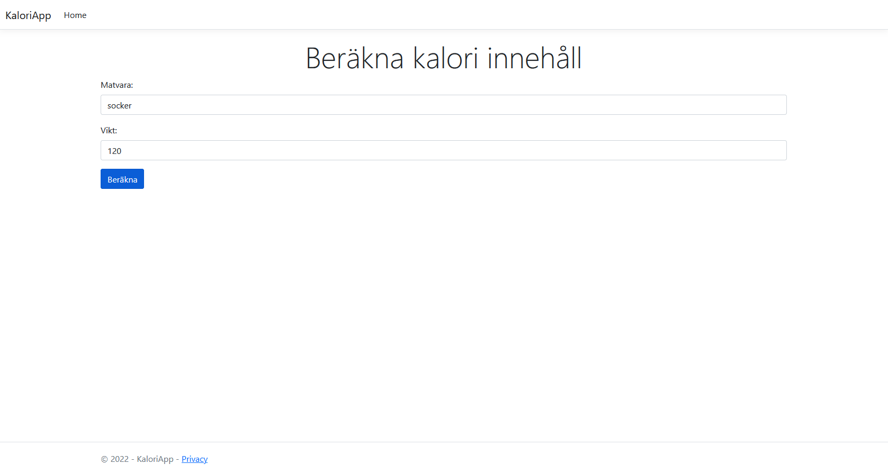

Kalori App is a website under development. The website is intended to help people keep track of calorie intake. This project will not be completed. The intention is just to work out on how to communicate with an API.

This is the website where the user interacts with the API.

# How it work
User enter food and weight and then press the button.
The result is the calorie content of the food
## View index

## View results
