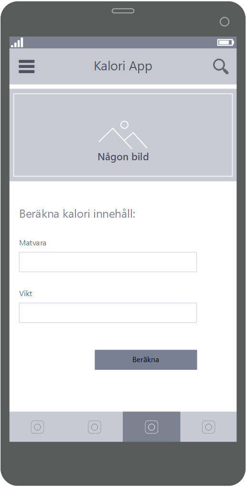
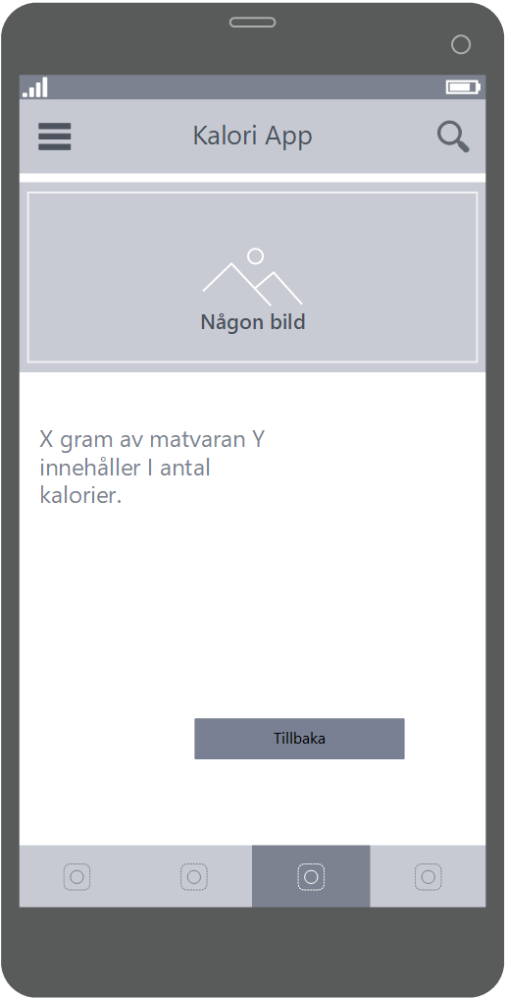
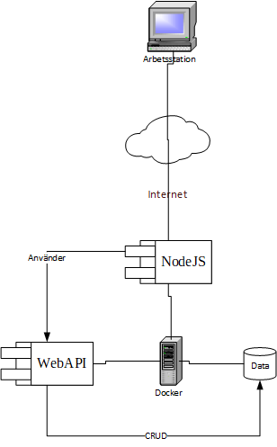

Kalori App is a website under development. The website is intended to help people keep track of calorie intake. This project will not be completed. The intention is just to work out on how to communicate with an API.

This is the website where the user interacts with the API.

# Model av första iteration
## Krav/Fall
Skapa en webbplats som hjälper personer att hålla koll på kalori-intaget. En användare ska kunna beräkna kalorier en viss matvara. När användaren anger vikt enligt gram, räknar datorn ut antal kalorier. 
# System
Backend NodeJS 
Frontend C# WebAPI
# Mål
Implementera ett användningsfall och redovisa för teamet
# Avgränsning
Programmet avgränsas till att endast beräkna kalorier för matvaran socker
# Design
## Form

## Svar

# Arketektur
